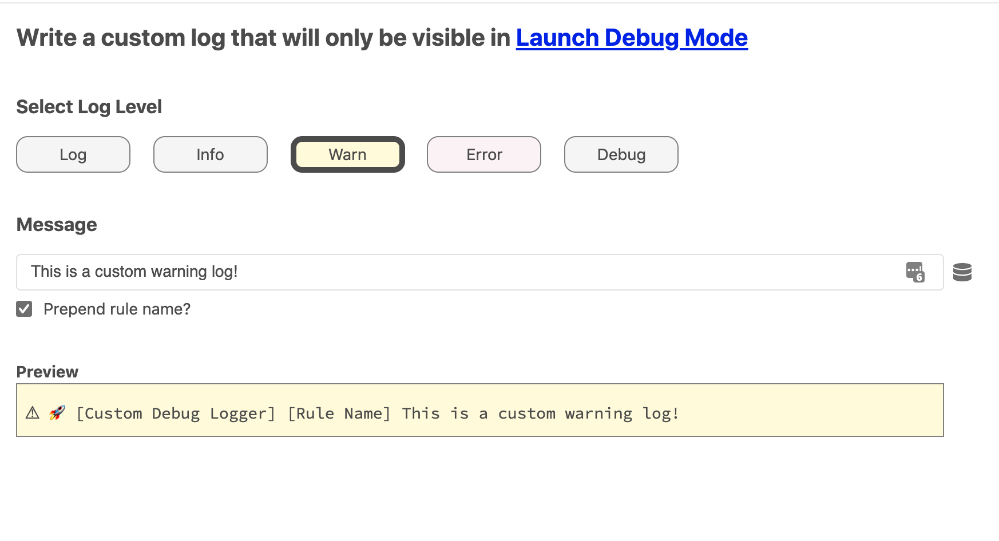
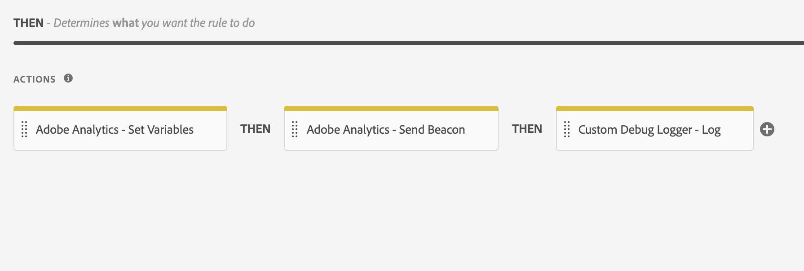
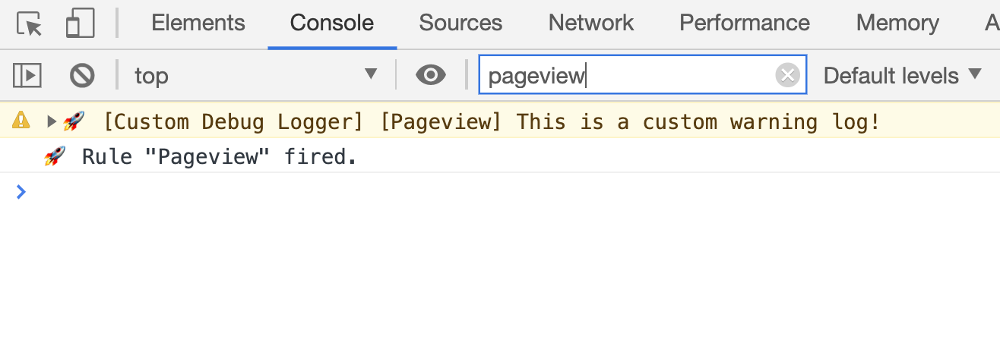

# Custom Debug Logger Extension for Adobe Launch
Write custom satellite.logger logs using the Launch UI instead of custom code. You can also prepend the name of the rule to your message to identify where it originated from.

### Overview
<kbd>
	
</kbd>

### Actions
<kbd>
	
</kbd>

### Output
<kbd>
	
</kbd>